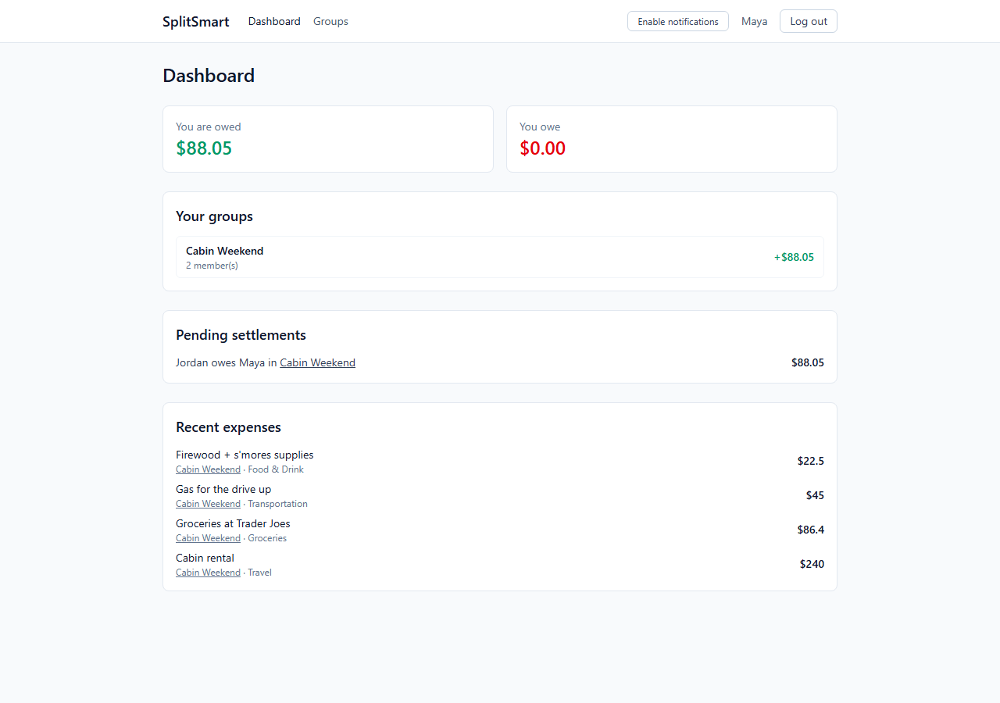
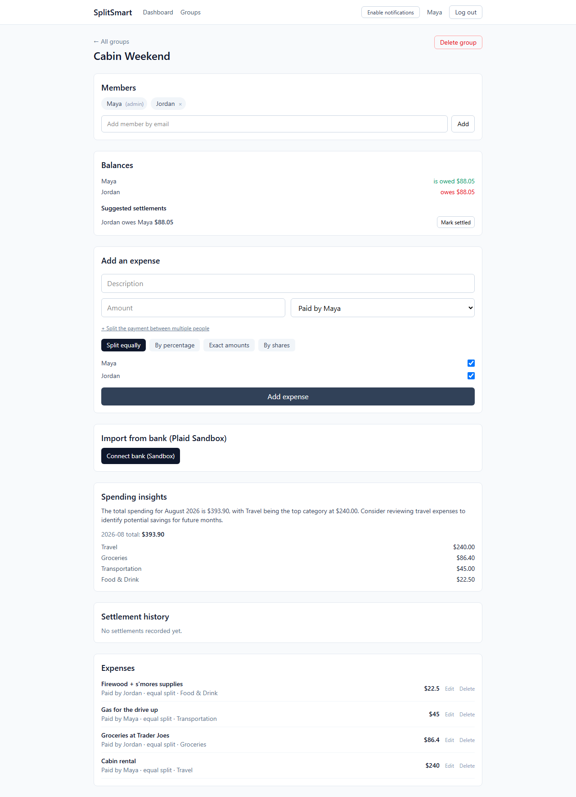

# SplitSmart

A Splitwise-style expense splitter for groups — split bills, track who owes who, import real bank transactions, and let AI handle the categorizing so you don't have to.



## What it actually does

- **Groups & expenses** — create a group, add people by email, log expenses against it
- **Split it however you want** — evenly, by exact dollar amounts, by percentage, or by shares (e.g. someone with a bigger room pays 2 shares of rent to your 1)
- **Multiple payers on one expense** — because sometimes two people split the bill at the restaurant before it even gets to the group
- **Debt simplification** — instead of everyone paying everyone back individually, the app collapses a group's tangle of debts down to the minimum number of payments needed to settle up (classic greedy largest-creditor/largest-debtor matching)
- **Bank import via Plaid** — connect a bank account (Sandbox mode, so it's fake data, but the integration is real) and turn transactions into shared expenses in one click
- **AI does the boring part** — every expense gets auto-categorized by OpenAI (gpt-4o-mini) so you never have to pick a category from a dropdown, and each group gets a plain-English monthly spending summary generated on the fly
- **A real dashboard** — total owed/owing across every group you're in, pending settlements, recent activity, all in one view
- **Push notifications** — real browser push (not a toast that disappears when you close the tab) when someone adds an expense, settles up, or adds you to a group
- **Redis-cached balances** — balances get computed from scratch and cached for 60 seconds, invalidated the instant something changes



## Stack

| Piece | What | Why |
|---|---|---|
| Frontend | React + Vite + TypeScript, Tailwind | fast, no build config headaches |
| Backend | Node.js + Express + TypeScript | boring and reliable |
| Database | PostgreSQL via Prisma | relational data, real migrations |
| Cache | Redis | balance caching, cache-aside pattern |
| Bank data | Plaid (Sandbox) | free forever, fake banks, real API |
| AI | OpenAI `gpt-4o-mini` | categorization + insights, pennies per call |
| Notifications | Web Push (VAPID) | no third-party push service, just the browser |
| Auth | JWT + bcrypt | nothing fancy, just correct |

## How the money math works

All currency math happens in integer cents internally (never floats) to avoid rounding drift, then gets converted back to dollar strings for storage and display. Splitting logic lives in one place and is shared by manual entries and Plaid imports alike, so a $10 coffee gets split the same way whether you typed it in or imported it from a bank feed.

Debt simplification is the more interesting bit: if Alice paid for dinner, Bob paid for gas, and Carol paid for the hotel, naively you'd need up to 6 individual payments to settle a 3-person group. The app nets everyone's balance down to who's a net creditor and who's a net debtor, then greedily matches the biggest creditor against the biggest debtor until everyone's at zero — usually 1-2 payments instead of 6.

## Running it locally

You'll need Docker (for Postgres + Redis), Node 20+, and free API keys from [Plaid](https://dashboard.plaid.com/signup) (Sandbox) and [OpenAI](https://platform.openai.com) if you want bank import and AI features working.

```bash
# 1. Spin up Postgres + Redis
docker compose up -d

# 2. Set up the backend
cd server
cp ../.env.example .env
# fill in PLAID_CLIENT_ID / PLAID_SECRET / OPENAI_API_KEY
# generate VAPID keys for push notifications:
node -e "console.log(require('web-push').generateVAPIDKeys())"
npm install
npm run prisma:migrate
npm run dev              # http://localhost:4000

# 3. Set up the frontend (separate terminal)
cd client
cp .env.example .env
npm install
npm run dev              # http://localhost:5173
```

Postgres runs on port `5433` (not the default `5432`) to avoid clashing with any local Postgres install you might already have.

